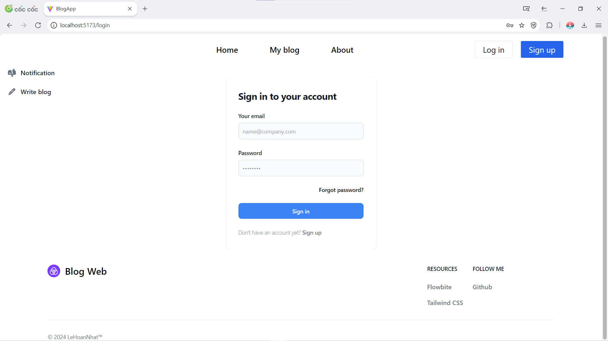
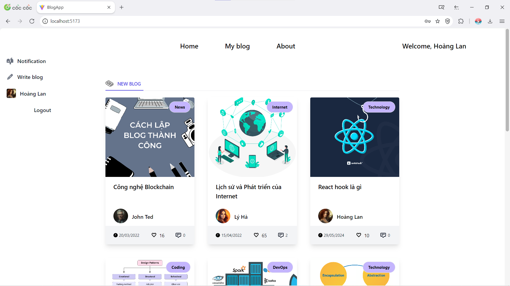
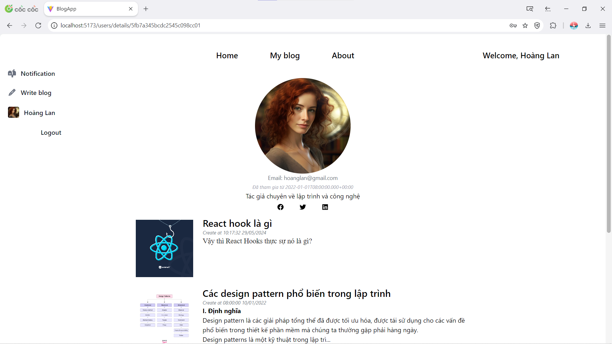
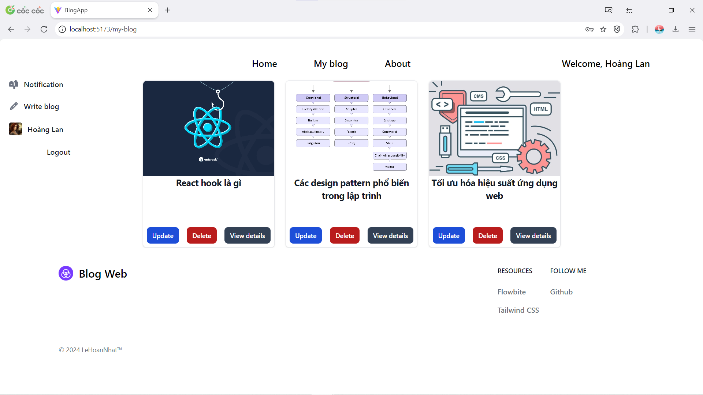
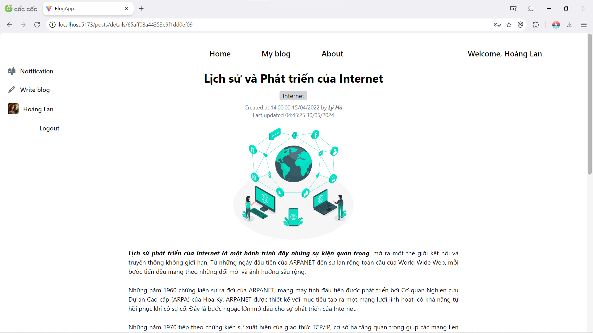
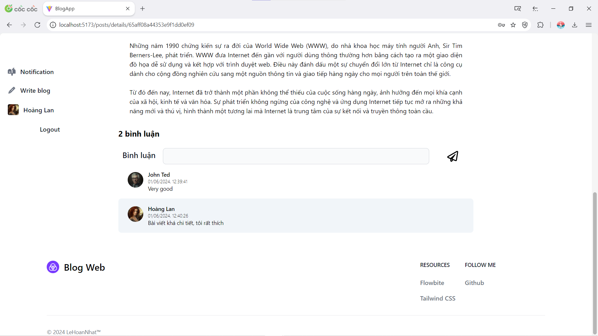
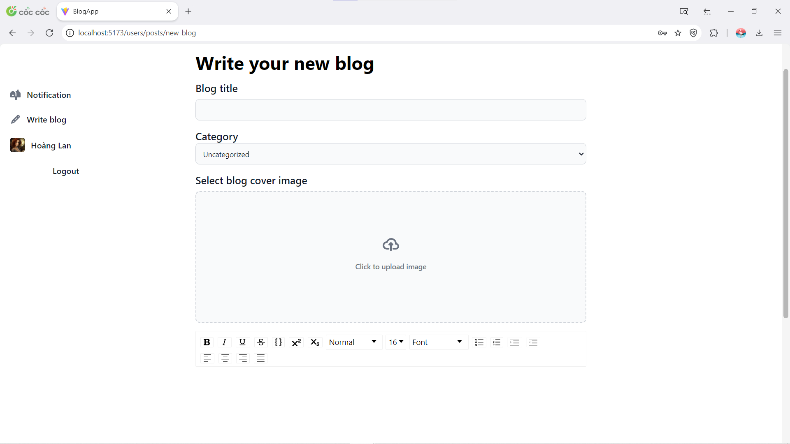

# Blog Website

Welcome to the Blog Website, a modern and fully-featured blogging platform built with React, Tailwind CSS, and a Java Spring backend. This project demonstrates the use of contemporary web development technologies and practices to create a seamless and efficient user experience.

## Features

- **Rich Text Editing**: Create and edit blog posts with a rich text editor.
- **Buid frontend with Tailwind CSS**: Easy design with tailwind framework
- **Image Upload with Fire base**: Upload and attach images to your blog posts.
- **User Authentication**: Secure login and registration functionality.
- **RESTful API**: Efficient and scalable backend built with Java Spring.

## Technologies Used

### Frontend

- **React**: A JavaScript library for building user interfaces.
- **Tailwind CSS**: A utility-first CSS framework for rapid UI development.
- **Draft.js**: A rich text editor framework for React.
- **Axios**: A promise-based HTTP client for making API requests.
- **React Router**: For handling client-side routing.

### Backend

- **Java Spring Boot**: A framework for building stand-alone, production-grade Spring-based applications.
- **Spring Data JPA**: For interacting with the database.

### Demo some image in web

**Login page**

**Home page**

**Author profile**

**Manage blog**

**View blog**

**Write new blog**

